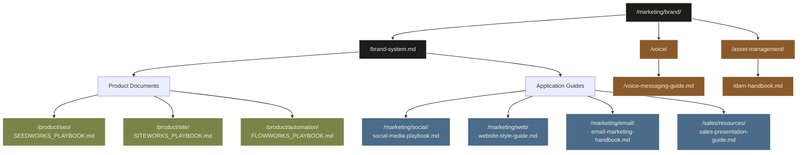

# Gruntworks Brand Documentation System: Relationship Map

## Document System Overview

The Gruntworks brand documentation system is organized with the marketing/brand directory as the central hub, containing the Brand System Guide and specialized subdirectories. The Brand System Guide establishes core identity principles, while specialized documents provide detailed guidance for specific applications.

### Core Documents
- **Brand Directory** (`/marketing/brand/`) - Central hub for all brand documentation
- **Brand System Guide** (`/marketing/brand/brand-system.md`) - Foundational reference establishing brand identity, strategy, and standards

### Brand Management Documents
- **Voice & Messaging Guide** (`/marketing/brand/voice/voice-messaging-guide.md`) - Detailed guidelines for content creation and messaging across contexts
- **Digital Asset Management Handbook** (`/marketing/brand/asset-management/dam-handbook.md`) - Protocols for managing, accessing, and maintaining brand assets

### Product Documentation
- **SeedWorks Playbook** (`/product/seo/SEEDWORKS_PLAYBOOK.md`) - Comprehensive guide for local SEO & GBP optimization service
- **SiteWorks Playbook** (`/product/site/SITEWORKS_PLAYBOOK.md`) - Detailed specifications for website development service
- **FlowWorks Playbook** (`/product/automation/FLOWWORKS_PLAYBOOK.md`) - Complete framework for automation & CRM implementation service

### Application-Specific Guides
- **Social Media Playbook** (`/marketing/social/social-media-playbook.md`) - Platform strategies, content frameworks, and management protocols
- **Website Style Guide** (`/marketing/web/website-style-guide.md`) - Component specifications, UX patterns, and content guidelines
- **Email Marketing Handbook** (`/marketing/email/email-marketing-handbook.md`) - Template systems, campaign frameworks, and optimization approaches
- **Sales & Presentation Guide** (`/sales/resources/sales-presentation-guide.md`) - Pitch materials, proposal frameworks, and client journey mapping

## Document Locations

| Document | File Path |
|----------|-----------|
| Brand System Guide | `/marketing/brand/brand-system.md` |
| SeedWorks Playbook | `/product/seo/SEEDWORKS_PLAYBOOK.md` |
| SiteWorks Playbook | `/product/site/SITEWORKS_PLAYBOOK.md` |
| FlowWorks Playbook | `/product/automation/FLOWWORKS_PLAYBOOK.md` |
| Brand Voice & Messaging Guide | `/marketing/brand/voice/voice-messaging-guide.md` |
| Digital Asset Management Handbook | `/marketing/brand/asset-management/dam-handbook.md` |
| Social Media Playbook | `/marketing/social/social-media-playbook.md` |
| Website Style Guide | `/marketing/web/website-style-guide.md` |
| Email Marketing Handbook | `/marketing/email/email-marketing-handbook.md` |
| Sales & Presentation Guide | `/sales/resources/sales-presentation-guide.md` |

## Usage Guidelines

1. **Start with the Brand System Guide** for foundational understanding of the Gruntworks brand
2. **Reference specific documents** when working on specialized projects or content types
3. **Maintain consistency** by aligning all materials with the principles in the Brand System Guide
4. **Report inconsistencies** to the brand team at brand@gruntworks.com 