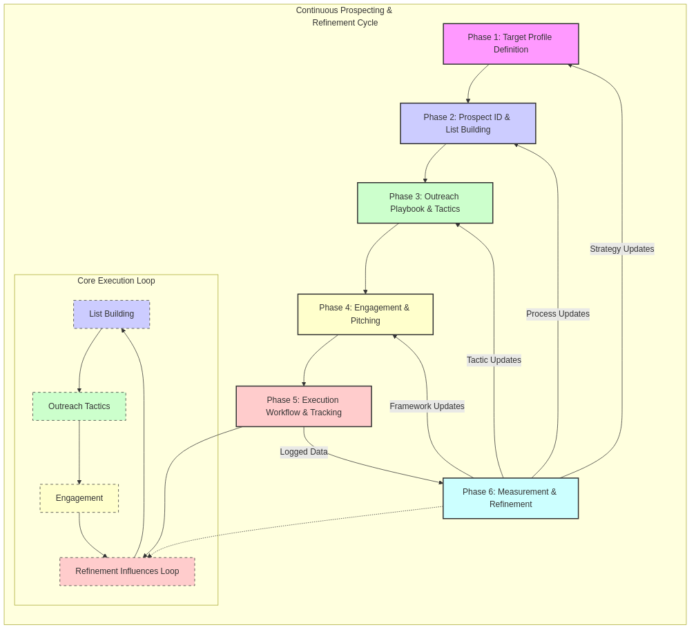

# Landscaping Outreach Strategy - Architecture

## 1. Overview
This document outlines the architecture of the Landscaping Outreach Strategy, defining its core components, processes, relationships, and governing factors. The strategy follows a **Continuous Prospecting & Refinement Cycle** approach, designed for high flexibility and incremental execution by a single salesperson using Kanban principles.

## 2. Overarching Structure: Continuous Prospecting & Refinement Cycle
The strategy operates as an iterative cycle: ongoing prospecting and outreach activities feed data into a periodic review process, which in turn refines the strategy for subsequent cycles. This allows for adaptation based on real-world results.
*(See diagram below for visual representation)*

## 3. Primary Components / Strategy Phases
The strategy is broken down into distinct phases, typically executed cyclically after initial setup:
- **Phase 1: Target Profile & Segmentation:** Defining the ideal customer and target market.
- **Phase 2: Prospect Identification & List Building:** Process for acquiring and managing prospect data.
- **Phase 3: Outreach Playbook & Tactics:** Documenting specific non-digital outreach methods.
- **Phase 4: Engagement & Pitching Framework:** Guidelines for initial contact and securing meetings.
- **Phase 5: Execution Workflow & Tracking:** Daily/weekly process and CRM/spreadsheet usage.
- **Phase 6: Measurement & Refinement Loop:** Periodic review of KPIs to improve the strategy.

## 4. Key Relationships & Dependencies
- **Information Flow:** Describes how data (prospect info, results) moves between phases and tools (CRM/Spreadsheets). Emphasizes the feedback loop from measurement back to strategy refinement.
- **Process Sequence:** Outlines the initial setup flow vs. the ongoing execution cycle.
- **External Dependencies:** Highlights reliance on external data sources, tools (scraping, CRM), services (direct mail), and budget.

## 5. Core Operational Aspects
- **Stakeholders & Roles:** Defines the primary executor (Sales Person) and oversight (Sales Leadership).
- **Decision Gates:** Specifies key approval points (budget, tactic prioritization).
- **Success Metrics / KPIs:** Lists the key metrics for measuring strategy effectiveness (e.g., Contact Rate, Meeting Set Rate, List Accuracy).
- **Communication & Reporting:** Details how results are tracked (CRM/Dashboards) and reported.

## 6. Governing Factors
- **Applicable Standards/Policies:** Emphasizes compliance with outreach regulations (TCPA, CAN-SPAM), data privacy, ethical data acquisition, and brand guidelines.
- **Core Assumptions:** Lists the fundamental assumptions underpinning the strategy.
- **Key Constraints:** Defines limitations like budget, time, and data quality.

## 7. Architecture Diagram (Visualization)

[Link to Mermaid Source](./architecture/architecture.mmd) 